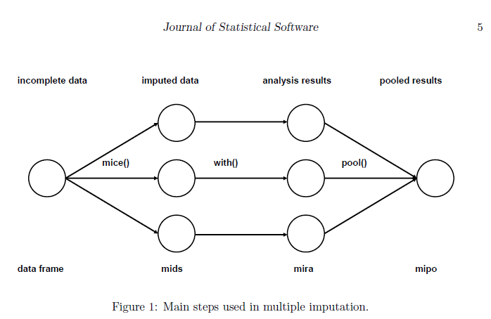

/\* Whole document: \*/ body{ font-family: Helvetica; font-size: 16pt; }

```{r}
rm(list=ls())
```

```{r setup, include=FALSE, warning = FALSE}
knitr::opts_chunk$set(echo = TRUE)
```

# Tutorial for Multiple Imputation in R

## Introduction

Missing data (or missing values) is defined as the data value that is
not stored for a variable in the observation of interest. The problem of
missing data is relatively common in almost all research and can have a
significant effect on the conclusions that can be drawn from the data.

A common misconception of missing data methods is the assumption that
imputed values should represent "real" values. The purpose when
addressing missing data is to correctly reproduce the
variance/covariance matrix we would have observed if our data had not
any missing information.

The aim of this practical is to discuss commonly used techniques for
handling missing data and common issues that could arise when these
techniques are used. We will focus on one of the most popular methods,
**multiple imputation**. But, depending on the type of data and model
you will be using, other techniques such as direct maximum likelihood
may better serve your needs.

We will use the data set ***hip.csv***. This data set is made up for
this practical. The R code for this practical was developed using R
4.2.1 version.

## Load and evaluate the data set

**The Hip Replacement (HIP) data set**

The hip data set contains information on seven hundred and eight
patients receiving primary hip replacement surgery for osteoarthritis
(variable `id` is the unique patient identifier). Prior to the
operation, patients completed a pre-operative Oxford Hip Score (OHS) and
EQ5D (Euroqol) questionnaire with a follow-up questionnaire being filled
in at 6-months post-surgery. The OHS consists of 12 questions asking
patients to describe their hip pain and function during the past 4
weeks. An overall score is created by summing the responses to each of
the 12 questions, ranging from 0 to 48, where 0 is the worst possible
score (severe symptoms) and 48 the best score (excellent joint
function). Variable `ohs0` is the preoperative score and `ohs6`
post-operative. The absolute change in OHS between pre- and
post-operative assessments (variable `ohsdiff`) is negative if patient
symptoms have improved and positive for worsening.

The pre-operative `eq5d0` contains information from 5 questions asking
about a patient's health state today, covering mobility, self-care,
usual activities, pain, and anxiety. The `eq5d0` has been converted to a
single summary score (variable `eq5d0`), anchored at 0 for death and 1
for full health, with some health states being worse than dead (-0.594).

Six months after their operation patients were asked about their overall
satisfaction with the outcome of surgery measured on a visual analogue
scale from 0 to 100 (variable `satisfaction`).

Pre-operative information was collected on `age` at the time of surgery,
`sex` (0 = Male; 1 = Female), `height` (metres) and `weight` (kg) (from
which body mass index (`bmi`) is calculated), `side` of surgery (Left;
Right), `ethnic` group (0 = White; 1 = Non white), whether or not they
are `retired` (0 = Not retired; 1 = Retired), `smoking` (0 = Non-smoker;
1 = Smoker) and `occupation` is defined as 1 if the individual is manual
worked and 0 if not. The Index of Multiple Deprivation is a measure of
social deprivation, linked to the area a patient lives in (variable
`imdscore`)

```{r dplyr, results='hide', warning = FALSE, message = FALSE}

#install.packages("dplyr")
library(dplyr)

#See your working directory
getwd()

#Update your working directory to the folder where "hip.data" is stored (if necessary)
update_wd = "NO" #"NO" for keeping the current working directory. "YES" to update, plus including the new path in folder_path variable below.
if(update_wd == "YES"){
folder_path <- ("C:/Users/msanchez/Documents/GitHub/Practical_Imputation/multiple-imputation_with_mice/")  #Remind to use / (NOT \)
setwd(folder_path)}

#load data
data <- read.csv("hip.csv", sep=',')


#Display the names of variables in the data set.
names(data)

#transform/include labels to data
data = data %>% 
            mutate(sex = factor(sex, levels = c(0,1), labels = c("Male","Female")),
                 retired = factor(retired, levels = c(0,1), labels = c("Not retired","Retired")),
                 ethnic = factor(ethnic, levels = c(0,1), labels = c("White","Non white")),
                 side = factor(side, levels = c(0,1), labels = c("Right","Left")),
                 smoking = factor(smoking, levels = c(0,1), labels = c("Non-smoker","Smoker")),
                 occupation = factor(data$occupation, levels = c(0,1), labels = c("Non-manual worker","Manual worker")) )

#Observe/explore the data
dim(data)
summary(data)
```

**Quiz**

[*Check the structure of the data*]{.underline}:

-   How many cases (individuals) are in the data? 708

-   How many variables do we have? 17

-   Which are numeric? age, oh0, oh6, ohsdiff, EQ5D0, height, weight,
    satisfaction, bmi and imdscore

-   Which are factor? sex, retired, ethnic, side, smoking and occupation

-   Is there any variable with missing values? Yes. EQ5D0, height,
    weight, bmi, satisfaction, ethnic, imdscore and smoking

-   Describe the outcome: Mean (-18.6), Median (Range): -19 (-43-19).
    Mean and median values are very close, so we can think that the
    distribution of the outcome is normal. You would like to check this
    assumption with a density plot or histogram. The majority of
    patients improved in terms of pain and function after surgery
    (negative values).

    ------------------------------------------------------------------------

## Exploring missing data mechanisms

There are three typical mechanisms causing missing data:

-   Missing completely at random (MCAR): The probability of data being
    missing is the same for all cases (not depend on the observed or
    unobserved data)
    -   In the presence of MCAR, complete cases analysis will not
        results in biased parameter estimates (e.g. regression
        coefficients)
-   Missing at random (MAR): The probability of data being missing is
    the same only within groups defined by the observed data.
    -   In the presence of MAR, **multiple imputation** methdos may lead
        to unbiased results
-   Missing not at random (MNAR): The probability of data being missing
    varies for reasons that are unknown to us or does depend on the
    unobserved data, conditional on the observed data


To explore the mechanism of the missing data in our data set, we can
check if missingnes are associated with completed variables.

1.  We can check if missing values are associated to observed variables
    using a correlation matrix:

```{r, results='hide',warning = FALSE, message = FALSE, fig.show='hide'}
#list the variables you want to test
miss_var_list = c("eq5d0", "ethnic", "imdscore", "bmi", "smoking")
complete_var  = c("age", "sex", "ohsdiff","ohs0")
library(ggcorrplot)

#Generate a data frame where missing variables are codified by 0=non-missing value and 1=missing value:
miss_data =  data %>% mutate(
  miss_eq5d0= ifelse(is.na(eq5d0),1,0), 
  miss_ethnic= ifelse(is.na(ethnic),1,0), 
  miss_imdscore= ifelse(is.na(imdscore),1,0), 
  miss_bmi=ifelse(is.na(bmi),1,0), 
  miss_smoking= ifelse(is.na(smoking),1,0) )

corr_var = c("miss_eq5d0", "miss_ethnic", "miss_imdscore", "miss_bmi", "miss_smoking", complete_var)

model.matrix(~0+., data=miss_data[corr_var]) %>% 
  cor(use="pairwise.complete.obs")  %>% 
  ggcorrplot(show.diag = F, type="lower", lab=TRUE, lab_size=2)
```

-   What is the correlation between bmi and ethnic missingnes? how does
    it mean? The correlation is 0.99, and that means that the variables
    bmi and ethnic have almost the same missing values.

2.  Create a dummy variable/s where missing values are classified as 1
    and complete values as 0, then we run a logistic regression:

```{r, results='hide',warning = FALSE, message = FALSE}
#list the variables you want to test
miss_var_list = c("eq5d0", "bmi", "ethnic", "imdscore","smoking")
complete_var  = c("age", "sex", "retired", "ohsdiff","side","occupation")

for (v in 1:length(miss_var_list)){
 miss_var = ifelse(is.na(data[[miss_var_list[v]]]), 1, 0)
 test = glm(miss_var ~ ., data=data[complete_var] )
 print(paste("Tested variable: ", miss_var_list[v], sep="")) 
 print(summary(test))   #Check p_value
}
```

3.  Alternative, we can use the function na.test() from the package
    misty: This function tests all your data set.

```{r, misty, results='hide',warning = FALSE, message = FALSE}
library(misty)

#We are excluding 'id' from the dataset.
na.test(within(data, rm(id)))
```

[*Interpretation of the function na.test()*]{.underline}*:*

If the output is statistically significant p-value (p≤0.05), indicates
that the result provides evidence against "Missing Completely at Random"
(MCAR) and therefore, the missing data are MAR or MNAR. In this
situation, complete cases analysis will give bias results, therefore,
you need to impute.

If the result is not statistically significant p\>0.05, indicates that
the test is failing to reject the null hypothesis. But, it doesn't prove
that the data is MCAR, so data might or not be MCAR. If you suspect that
an unobserved variable/s may explain the missingness of your data, you
still need to impute your data, assuming that it is MAR.

------------------------------------------------------------------------

## Multiple Imputation in R

Multiple imputation is a simulation-based statistical technique for
handling missing data. It is now accepted as the best general method to
deal with incomplete data. Multiple imputation was developed by Donal B.
Rubin in the 1970's.

### 1. Procedure

Multiple imputation creates more than one complete data sets (m). Each
of these data sets is analysed by standard analysis software. The m
results are pooled into a final point estimate plus standard error by
pooling rules ("Ruben's rules").

Multiple imputation consists of three steps: imputation, analysis and
pooling.


-   *Imputed data:* it creates several complete data (m) sets where
    missing values are replaced by plausible data values. Plausible
    values are taken from the distribution modeled for each missing
    entry.

-   *Analysis results:* it estimates the parameters of interest from
    each imputed data set.

-   *Pooled results:* it pools the m parameter estimates into one
    estimate, and to estimate the variance. The variance combines the
    "within-imputation variance" and the "between-imputation variance".

    ------------------------------------------------------------------------

### 2. Preparing to conduct Multiple Imputation

> **NOTE:** The standard implementation of multiple imputation is based
> on the assumption of data being at least MAR.

When developing your imputation model, it is important to assess if your
imputation model is consistent with your analytic model. Consistency
means that your imputation model includes (at the very least) the same
variables that are in your analytic or estimation model. This also
includes any transformations to variables (e.g. log transformations,
interactions) that will be needed to assess your hypothesis of interest.

For example, if the analytic model has significant interactions, then
the imputation model should include them as well, if the analytic model
uses a transformed version of a variable then the imputation model
should use the same transformation.

Our analytic model contains:

-   The outcome/dependent variable (*Y*) is `ohsdiff` = change in ohs
    before and after surgery
-   The independent variables (*X's*) are = `age`, `sex`, `ethnic`,
    `imdscore` , `bmi`, `smoking` , `eq5d0` and `ohs0`

We are going to follow the next steps to built the imputation model:

#### 2.1. Examine the number of missing values among your variables of interest

We use the command `summary` command to count the number of missing
observations of missing for each variable of interest

```{r, results='hide',warning = FALSE, message = FALSE}

#Selecting variables of interest
analytic_model <- c("ohsdiff","age", "sex", "ethnic", "eq5d0", "imdscore", "bmi", "smoking", "ohs0")

#Observe/explore number of missing data
summary(data[analytic_model])

```

**Quiz**

-   Which is the variable with higher number of missing data? and which
    is the %? ethnic (\>50%)

| **NOTE**: At this point, you can decide if you want to remove variables with a high number of missingness from the analytic model, and therefore, for the imputation model, as they might mess up the imputation.

#### 2.2. Missing value patterns

Types of missing data patterns:[{width="628"}](https://stefvanbuuren.name/fimd/about-the-author.html)\
*Source: Flexible Imputation of Missing Data, Second Edition. Author:
Stefvan Buuren*

Some missing data patterns in multivariate data. Blue is observed, red
is missing:

1.  *Univariate and multivariate*. A missing data pattern is said to be
    *univariate* if there is only one variable with missing data.
2.  *Monotone and non-monotone (or general)*. A missing data pattern is
    said to be *monotone* when, if the variables are ordered from least
    to most missing, then all observations of a variable contain missing
    in the observations in which the prior variable contains missing
    (*it can occur as a result of drop-out in longitudinal studies*). If
    the pattern is not monotone, it is called *non-monotone or general*
3.  *Connected and unconnected*. A missing data pattern is said to be
    *connected* if any observed data point can be reached from any other
    observed data point through a sequence of horizontal or vertical
    moves (like the rook in chess).

The missing data pattern influences the amount of information that can
be transferred between variables.

Imputation can be more precise if other variables are non-missing for
those cases that are to be imputed. The reverse is also true. Predictors
are potentially more powerful if they have are non-missing in rows that
are vastly incomplete. This section discusses various measures of the
missing data pattern.

R has several functions to inspect the missing data pattern.

The mice package contains a function to inspect the missing data
pattern: `md.pattern()`

```{r, results='hide',warning = FALSE, message = FALSE}

#Selecting variables with missing data
miss_vars <- c( "eq5d0", "ethnic","imdscore", "bmi", "smoking")

#Exploring missing pattern with md.pattern() function
library(mice)
md.pattern(data[miss_vars], plot=FALSE)

```

-   Can you please interpreter the output table? what do you think it is
    displaying?

[*Interpretation of the output table:*]{.underline}

In the main body of the output table the values "1" indicates
non-missing value and "0" indicates missing value. The first column
shows the number of unique missing data patterns.

There are 238 observations with non-missing values, and there are 4
observations with non-missing values except for the variable `bmi`. The
rightmost column shows the number of missing variables in a particular
missing pattern. For example, the first row has no missing value and it
is "0" in the row. The last row counts the number of missing values for
each variable. For example, the variable `imdscore` contains 11 missing
values and the variable `bmi` contains 359 missing values. This table
can be helpful when you decide to drop some observations with missing
variables exceeding a preset threshold.

***Visual presentation of missing data pattern:***

We are using three different R functions to display visually the
patterns of the missing data:

```{r ggmice VIM, results='hide', warning = FALSE, message = FALSE, fig.show='hide'}

library(mice)
library(ggmice)
library(VIM)

md.pattern(data[miss_vars], plot=TRUE, rotate.names=TRUE)

plot_pattern(data[miss_vars], vrb = "all", square = FALSE, rotate = FALSE, cluster = NULL)

aggr(data[miss_vars], numbers=FALSE, prop=TRUE)

```

[*Interpretation of the plots:*]{.underline}

There are around 50% missing values in bmi and ethnic, 32% of missing
values in the variable smoking and less than 5% missing values in eq5d
and in the index of multiple deprivation.

See more at: [Chapter 4 Multivariate missing
data](https://stefvanbuuren.name/fimd/ch-multivariate.html){.uri}

**Quiz**

-   What type of missing data pattern you think we have in our data set?

    The displayed patterns are non-monotone (i.e., general).

#### 2.3. If necessary, identify potential auxiliary variables

Auxiliary variables are variables in your data set that are either
correlated with a missing variable(s) (the recommendation is r \>
\|0.4\|) or are believed to be associated with missingness. These are
factors that are not of particular interest in your analytic/main model
, but they are added to the imputation model to increase power and/or to
help make the assumption of MAR more plausible.

Explore missingness versus potential auxiliary variables (variables non
included in our main model):

Analytic/main model:

-   The **outcome** or **dependent variable** (*Y*) for this study is
    `ohsdiff` = change in ohs before and after surgery
-   The **independent variables** (*X's*) are = `age`, `sex`, `bmi`,
    `ethnic`, `imdscore` , `smoking`

```{r ggcorrplot, results='hide',warning = FALSE, message = FALSE, fig.show='hide'}
library(ggcorrplot)

#explore which other variables we have available in the data set
names(data)

#list the variables you want to test
miss_var_list = c("eq5d0", "ethnic", "imdscore", "bmi", "smoking")
auxiliar_var  = c("retired", "satisfaction", "side", "occupation")

#Generate a data frame where missing variables are codified by 0=non-missing value and 1=missing value:
miss_data =  data %>% mutate(
  miss_eq5d0= ifelse(is.na(eq5d0),1,0), 
  miss_ethnic= ifelse(is.na(ethnic),1,0), 
  miss_imdscore= ifelse(is.na(imdscore),1,0), 
  miss_bmi=ifelse(is.na(bmi),1,0), 
  miss_smoking= ifelse(is.na(smoking),1,0) )

corr_var = c("miss_eq5d0", "miss_ethnic", "miss_imdscore", "miss_bmi", "miss_smoking", auxiliar_var)

model.matrix(~0+., data=miss_data[corr_var]) %>% 
  cor(use="pairwise.complete.obs")  %>% 
  ggcorrplot(show.diag = F, type="lower", lab=TRUE, lab_size=2)
```

You need to think about which variables should be include in the
multiple imputation as auxiliaries (if any).

[**Quiz**]{.underline}

-   Which pairs of variables have a correlation \> 0.4? None

#### 2.4. Missing variables with non-linear effects and interactions

There is often a need for transformed, combined or recoded versions of
the data. In the case of incomplete data, one could impute the original,
and transform the completed original afterwards, or transform the
incomplete original and impute the transformed version.

##### 2.4.1. Checking non-linear effect between numeric variables and outcome.

If we know that there is evidence of a non-linear association between a
numeric variable and the outcome, we should check it and transform the
variable (if needed):

```{r, results='hide', warning = FALSE, message=FALSE, fig.show='hide'}
#List of the variables you want to test (numeric variables)
num_var = c("age", "eq5d0", "bmi", "imdscore" )
outcome = "ohsdiff"

for (v in 1:length(num_var)){
  df = cbind(data[num_var[v]],outcome = data[[outcome]])
  linear_test = lm(outcome ~ ., data = df)
  par(mfrow = c(2, 2))
  plot(linear_test,main=paste(num_var[v],"\n",sep=""))
}
```

[*Interpretation of the plots:*]{.underline}

The diagnostic plots show residuals in four different ways

-   *Residuals vs Fitted*: Used to check the linear relationship
    assumptions. A horizontal line, without distinct patterns is an
    indication for a linear relationship, what is good.
-   *Normal Q-Q*: Used to examine whether the residuals are normally
    distributed. It's good if residuals points follow the straight
    dashed line.
-   *Scale-Location (or Spread-Location)*: Used to check the homogeneity
    of variance of the residuals (homoscedasticity). Horizontal line
    with equally spread points is a good indication of homoscedasticity.
-   *Residuals vs Leverage*: Used to identify influential cases, that is
    extreme values that might influence the regression results when
    included or excluded from the analysis.

[**Quiz**]{.underline}

-   Is the relationship between independent numeric variables and
    outcome linear? if it is not, what do your think we should do?
    Transform the variables. Simplest e.g. Categorization

-   Which variables does follow a normal distribution?

-   Which variables does not follow a normal distribution?

##### 2.4.2. Checking potential interaction effects

An interaction effect occurs when the effect of one variable on outcome
depends on the value of another variable. If we suspect that there is an
interaction in our analytic model, it should be included in the
imputation model.

Based on previous literature, `sex` can be a potential effect modifier
of the relationship between `bmi` and `ohsdiff` (outcome). Thus, we
should check if the interaction effect exists and then include it in the
imputation model.

R has the `interaction.plot()` function built-in, however, you can only
test one numeric variable vs two factors. Since `bmi` and the `outcome`
are numeric, we will categorise `bmi` to run this function.

`interaction.plot()` arguments:

-   x.factor = a factor variable whose levels will be on the X-axis.
    (aka. x-axis variable)
-   trace.factor = the second-factor variable whose levels will be
    represented as traces (aka. variable for lines).
-   response = a numeric response variable. (aka. y-axis variable)
-   fun = The function to compute the summary, e.g. median.
-   ylab = Y-axis label of the plot.
-   xlab = X-axis label of the plot.
-   trace.label = Label for the legend.
-   col = A vector of colors used for all traces.
-   lyt = A type of the lines drawn.
-   lwd = Width of the lines drawn.

```{r, results='hide', warning = FALSE, message=FALSE, fig.show='hide'}

##1) Check outcome distribution:
#By ploting the histogram we can see if the outcome distribution is skewed or not. 
hist(data$ohsdiff)
#If the outcome has a normal distribution, use de mean, otherwise use the median (ie. fun = mean OR fun = median)

##2.A) Spliting bmi in 2 categories:
bmi_2 = ifelse(data$bmi >= 25, "25+", "<25")

#interaction.plot using median of ohsdiff (outcome)
interaction.plot(x.factor=bmi_2, trace.factor=data$sex, response=data$ohsdiff, fun = median,  col = c("#0198f9", "#f95801")) 

#interaction.plot using mean of ohsdiff (outcome)
interaction.plot(x.factor=bmi_2, trace.factor=data$sex, response=data$ohsdiff, fun = mean,  col = c("#0198f9", "#f95801")) 

##2.B) Spliting bmi in >2 categories:
bmi_cat=with(data, cut(bmi, breaks = c(0,18.5,25,30,70), labels = c('underweight','normal', 'overweight', 'obese'),right=FALSE))

bmi_cat=with(data, cut(bmi, breaks = c(0,25,30,70), labels = c('<25', 'overweight', 'obese'),right=FALSE))

#interaction.plot using median of ohsdiff (outcome):
interaction.plot(x.factor=bmi_cat, trace.factor=data$sex, response=data$ohsdiff, fun = median,  col = c("#0198f9", "#f95801")) 

#interaction.plot using mean of ohsdiff (outcome):
interaction.plot(x.factor=bmi_cat, trace.factor=data$sex, response=data$ohsdiff, fun = mean,  col = c("#0198f9", "#f95801"))
```

```{r, results='hide', warning = FALSE, message=FALSE, fig.show='hide'}

## Try test interaction with other independent variable. 

##Categorise varX if needed:
varX_cat = data$ethnic

#interaction.plot using median of ohsdiff (outcome):
interaction.plot(x.factor=varX_cat, trace.factor=data$sex, response=data$ohsdiff, fun = median,  col = c("#0198f9", "#f95801")) 

#interaction.plot using mean of ohsdiff (outcome):
interaction.plot(x.factor=varX_cat, trace.factor=data$sex, response=data$ohsdiff, fun = mean,  col = c("#0198f9", "#f95801")) 
```

[*Interpretation the plots*]{.underline}*:*

In general, if the two lines on the interaction plot are parallel then
there is no interaction effect. However, if the lines intersect then
there is likely an interaction effect.

**Quiz**

Do you think that `sex` is an effect modifier of the relationship
between `bmi` and `ohsdiff`? No, it is not

##### 2.4.3. **How do I treat variable transformations such as logs, quadratics and interactions?**

Most of the current literature on multiple imputation supports the
method of treating variable transformations as "just another variable"
(mainly if the analysis model is linear regression).

But, if you want to maintain the property of your data in the resulting
imputed values, **mice** package in R (*further details in*
[RDocumentation](https://www.rdocumentation.org/packages/mice/versions/3.14.0/topics/mice)
*or typing* help(mice) *in your console*) has a built-in approach,
called *passive imputation*, to deal with situations as described above.
The goal of passive imputation is to maintain the consistency among
different transformations of the same data.

  ------------------------------------------------------------------------

### 3. Imputations with mice (Multivariate Imputation by Chained Equations)

The **mice** package (*further details in*
[RDocumentation](https://www.rdocumentation.org/packages/mice/versions/3.14.0/topics/mice)
*or typing* help(mice) *in your console*) implements a method to
complete missing data based on Fully Conditional Specification, where
each incomplete variable is imputed by a separate model. Then name of
this function is the same than the package (i.e., `mice()` )

A simple version of the code for running the mice() function can looks
as following:\
**mice(data, maxit=10, m = 5,seed=60109)**

where:

-   data: your data frame

-   maxit: is the number of iterations for each imputation. The default
    is 5. It is important that the imputations for all variables reach
    convergence, otherwise they will be inaccurate.

-   m: number of multiple imputations (multiple data sets returned by
    the function). The observed data will be the same across the imputed
    data sets; only the values that had originally been missing will
    differ. The default number of imputations is 5.

When using the mice package, the steps for your analysis are the
following:

1.  First your create your m imputed data sets. (mice() - function)

2.  Then you do your analysis on each of these data sets. (with() -
    function)

3.  In the end you combine these results together. (pool() - function)

    

#### 3.1. Selecting the number of imputations (*m*)

Generally the more the better, but then the analysis takes longer to run
and it consume more computational resources. A thumb up rule regarding
the percentage of missingness is commonly used: if there is a 10% of
missing, include 10 imputations; if there is a 20% missing, run 20
imputations, etc.

> NOTE: Although our data have more than 50% of missing values, we will use the default (m=5) in this example to save computation time.

#### 3.2. Choosing imputation methods.

There are nine methods available for imputing a variable: **regress,
pmm, truncreg, intreg, logit, ologit, mlogit, poisson and nbreg**.

|  Method  |             Description              |     Scale type      | Default |
|:----------------:|:-----------------:|:----------------:|:----------------:|
|   pmm    |       Predictive mean matching       |       numeric       |    Y    |
|   norm   |      Bayesian linear regression      |       numeric       |         |
| norm.nob |   Linear regression, non-Bayesian    |       numeric       |         |
|   mean   |    Unconditional mean imputation     |       numeric       |         |
| 2L.norm  |        Two-level linear model        |       numeric       |         |
|  logreg  |         Logistic regression          |  factor, 2 levels   |    Y    |
| polyreg  |       Multinomial logit model        | factor, \>2 levels  |    Y    |
|   polr   |         Ordered logit model          | ordered, \>2 levels |    Y    |
|   lda    |     Linear discriminant analysis     |       factor        |         |
|  sample  | Random sample from the observed data |         any         |         |

-   Which variables we want to impute? EQ5D0, bmi, ethnic, imdscore and
    smoking

The `mice` package assumes a distribution for each variable and imputes
missing variables according to that distribution. Hence, it is important
to correctly specify each of these distributions. `mice` automatically
chooses distributions for variables.

If we would like to change the methods used to impute the missing
values, we can do it by changing the methods' characteristics.

*You can follow the following three lines of the code*\
3.1 Choose the variables we want to impute\
3.2 Save the name of the variables that will be included in the
imputation model\
3.3 Check the imputation method used for each variable

```{r, results='hide', warning = FALSE, message=FALSE}
library(mice)

##3.1) Choose the variables we want to include in the imputation model 
names(data)

##3.2) Select them
impmodel_var=c("age","sex","ohs0","ohsdiff","ethnic","eq5d0","bmi","imdscore","smoking")#3.2

#We run the mice code with 0 iterations 
imp <- mice(data[impmodel_var], m=5, maxit=0, seed=60109)
#Check the method mice used to impute
imp$method

#mice has identified the correct distribution for each variable. But, if you want to change the method used, you can do the following:

meth <- imp$method

# Numeric variables - normal distribution (we are using "Linear regression, non-Bayesian" method to impute bmi)
norm <- c("bmi")
# Numeric variables - non-normal distribution
nonnorm <- c("eq5d0", "imdscore")
# Dichotomous variable
log <- c("ethnic", "smoking")

# Turn their methods matrix into the specified imputation models
meth[norm] <- "norm.nob"
meth[nonnorm] <- "pmm"
meth[log] <- "logreg"

imp2 <- mice(data[impmodel_var], m=5, maxit = 0, method = meth, seed=60109)

#Check that mice is using the specific method
imp2$method
```

  ------------------------------------------------------------------------

### 4. Pooling results

The pool() function combines the estimates from m repeated complete data
analyses using Rubin's rules. The typical sequence of steps to do a
multiple imputation analysis is:

7.1 Impute the missing data by the mice function, resulting in a
multiple imputed data set (class mids);

7.2 Fit the model of interest (scientific model) on each imputed data
set by the with() function, resulting an object of class mira;\
*Classic statistical analysis has been implemented/are compatible to
with() function and can be called in the argument 'expr=' (for
expression), such as linear regression* (*lm()).*

7.3 Pool the estimates from each model into a single set of estimates
and standard errors, resulting is an object of class mipo;

Optionally, compare pooled estimates from different scientific models by
the pool.compare() function.

We create the impute data sets with the function `mice`:

```{r, results='hide', warning = FALSE, message=FALSE}
impmodel_var=c("age","sex","ohs0","ohsdiff","ethnic","eq5d0","bmi","imdscore","smoking")

imp = mice(data[impmodel_var], maxit=10, m = 5, seed=60109)  #7.1
fit = with(data=imp,expr = lm(ohsdiff~age+sex+bmi+eq5d0+ethnic+imdscore+smoking+ohs0)) #7.2
summary(pool(fit), conf.int = TRUE) #7.3
```

  ------------------------------------------------------------------------

### 5. Checking after imputation

We can observe which values has been imputed:

-   The `stripplot()` is useful to study the distributions in data sets
    with a low number of data points.
-   For large data sets it is more appropriate to use the function
    `bwplot()` that produces side-by-side box-and-whisker plots for the
    observed and synthetic data.

```{r, results='hide', warning = FALSE, message = FALSE, fig.show='hide'}
impmodel_var=c("age","sex","ohs0","ohsdiff","ethnic","eq5d0","bmi","imdscore","smoking")#3.2

imp = mice(data[impmodel_var], maxit=10, m = 5, seed=60109)  #7.1
fit = with(data=imp,expr = lm(ohsdiff~age+sex+bmi+eq5d0+ethnic+imdscore+smoking+ohs0)) #7.2
summary(pool(fit), conf.int = TRUE) #7.3

#Observe which values has been imputed
stripplot(imp) #blue = observed data; red = imputed data
bwplot(imp)    #blue = observed data; red = imputed data
```

Evaluate differences between observed and imputed data:

1.  Observe their distribution before (observed) and after (imputed
    data):

```{r, results='hide', warning = FALSE, message = FALSE, fig.show='hide'}
densityplot(imp) #blue line = observed data; red lines = imputed data 
```

**Quiz**

-   Do you think distributions match up well? Yes

2.  Compare the distributions of observed and imputed data conditional
    on the missingness probability.

Interpretation is more difficult if discrepancies are shown in the
density plot. Such discrepancies may be caused by a bad imputation
model, by a missing data mechanism that is not MCAR or by a combination
of both.

If there are discrepancies, Bondarenko and Raghunathan (2016) proposed a
more refined diagnostic tool that aims to compare the distributions of
observed and imputed data conditional on the missingness probability.
The idea is that [under MAR the conditional distributions should be
similar if the assumed model for creating multiple imputations has a
good fit]{.underline}. An example is created as:

```{r, results='hide', warning = FALSE, message = FALSE, fig.show='hide'}

#Model the probability of each record being incomplete as a function of all variables in each imputed data set.
fit <- with(imp, glm(ici(imp)~ohsdiff+age+sex+bmi+eq5d0+ethnic+imdscore+smoking+ohs0, family = binomial)) 

# The probabilities (propensities) are then averaged over the imputed datasets to obtain stability.
ps <- rep(rowMeans(sapply(fit$analyses, fitted.values)),
          imp$m + 1)

#Plot the each variable against the propensity score in each dataset:
#blue = observed data; red = imputed data
xyplot(imp, bmi ~ ps | as.factor(.imp),
       xlab = "Probability that record is incomplete",
       ylab = "BMI", pch = c(1, 19), col = mdc(1:2))

xyplot(imp, eq5d0 ~ ps | as.factor(.imp),
       xlab = "Probability that record is incomplete",
       ylab = "EQ5D0", pch = c(1, 19), col = mdc(1:2))

xyplot(imp, ethnic ~ ps | as.factor(.imp),
       xlab = "Probability that record is incomplete",
       ylab = "Ethnic", pch = c(1, 19), col = mdc(1:2))

xyplot(imp, imdscore ~ ps | as.factor(.imp),
       xlab = "Probability that record is incomplete",
       ylab = "imdscore", pch = c(1, 19), col = mdc(1:2))

xyplot(imp, smoking ~ ps | as.factor(.imp),
       xlab = "Probability that record is incomplete",
       ylab = "Smoking", pch = c(1, 19), col = mdc(1:2))

#impmodel_var=c("age","sex","ohs0","ohsdiff","ethnic","eq5d0","bmi","imdscore","smoking")
```

In this case, the distributions of the blue and red points are quite
similar, as expected under MAR.

3.  Compare complete results vs imputed results

```{r, results='hide', warning = FALSE, message = FALSE}

#Complete cases results:variables names, OR, Low and High CI
fit0 =lm(ohsdiff~age+sex+bmi+eq5d0+ethnic+imdscore+smoking+ohs0, data=na.omit(data))
print("Using complete cases")
print( cbind(OR=summary(fit0)$coefficients[,1],confint(fit0)) )

#Imputed results: variables names, OR, Low and High CI
fit = with(data=imp,expr = lm(ohsdiff~age+sex+bmi+eq5d0+ethnic+imdscore+smoking+ohs0))
print("Using imputed data")
summary(pool(fit), conf.int = TRUE)[c(1,2,7,8)]

```

Interpretation: After imputation, age is significant in our model.
Results regarding all other variables seems to be consistent before and
after imputation.

-   *Averaging the data*: You might be tempted to average the multiply
    imputed data, and analyze the averaged data as if it were complete.
    This method yields incorrect standard errors, confidence intervals
    and p-values, and thus should not be used if any form of statistical
    testing or uncertainty analysis is to be done on the imputed data.
    The reason is that the procedure ignores the between-imputation
    variability, and hence shares all the drawbacks of single imputation

-   *Stack imputed data*: creating m×n complete records by stacking the
    imputed data, where each record is weighted by a factor 1/m, so that
    the total sample size is equal to n. While the estimated regression
    coefficients are unbiased, we cannot trust the standard errors,
    t-values and so on. An advantage of stacking over averaging is that
    it is easier to analyze categorical data. Although stacking can be
    useful in specific contexts, like variable selection, in general it
    is not recommended.

<!-- -->

  ------------------------------------------------------------------------
  

[**AVOID***:*]{.underline}

### 6. What to do when a statistical analysis is not compatible with with() function

There might be cases where an analysis is such complex that you won't be
able to use the function with(). For this cases, the alternative is to
store the imputed data sets into a list, run the desired methods using a
loop, and later combine the results.

9.1 Run imputation\
9.2 Extract the imputed data sets: imp.data is a data.frame that
contains all the imputed data sets, which are distinguishable by the
variable .imp\
9.3 See de number of individuals for each imputed data set\
9.4 Create a list for storing the results where the length is the number
if imputed data sets\
9.5 Run a loop for each of the imputed data sets and store the results
in the list created in the previous step.\
9.6 Transform the list into a mira object to perform the pooling\
9.7 Pool the results

```{r, results='hide', warning = FALSE}
impmodel_var=c("age","sex","ohs0","ohsdiff","ethnic","eq5d0","bmi","imdscore","smoking")#3.2

imp = mice(data[impmodel_var], maxit=10, m = 5, seed=60109)   #9.1
imp.data = complete(imp , "long")   #9.2
table(imp.data$.imp)                #9.3
Fit.list = vector("list", length(unique(imp.data$.imp))) #9.4
Fit.list2= vector("list", length(unique(imp.data$.imp))) #9.4
for (i in unique(imp.data$.imp)) {  #9.5 Loop start
      fit = lm(ohsdiff~age+sex+ethnic+eq5d0+imdscore+bmi+smoking+ohs0, data = imp.data[imp.data$.imp == i,])
      Fit.list[[i]]= summary(fit)
                                  } #9.5
Fit.list.mira = as.mira(Fit.list)   #9.6 Loop end
summary(pool(Fit.list.mira),conf.int = TRUE) #9.7
```

